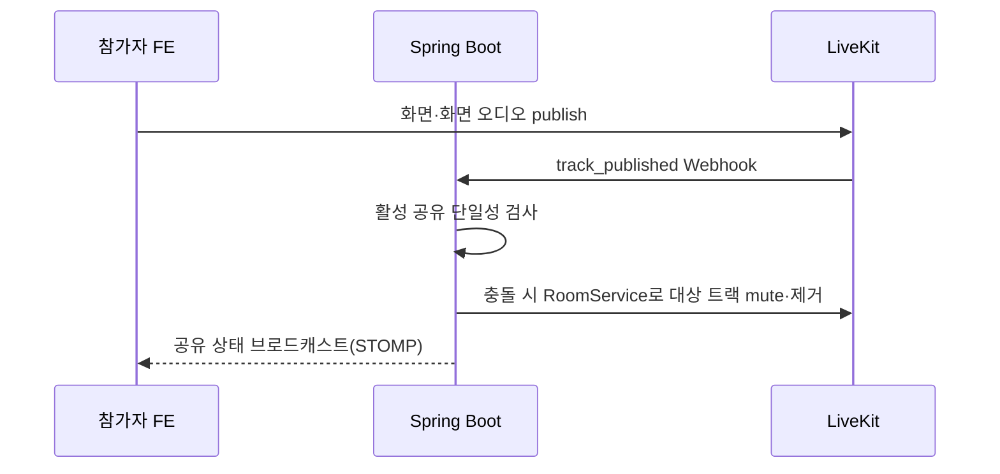

# ZANI LiveKit 백엔드 구현 가이드

## 1. 범위와 선행 규칙

이 문서는 Spring Boot가 ZANI 세션과 LiveKit을 연결하는 목표 계약을 정의한다. 전체 흐름은 [livekit-overview.md](./livekit-overview.md)를 먼저 읽는다.

백엔드 구현 시 다음 규칙이 우선한다.

- `../AGENTS.md`
- `./ddd-development-guide.md`
- `presentation -> application -> domain`, infrastructure는 inward-facing Port 구현
- LiveKit SDK·DTO·예외를 application/domain에 노출하지 않음

## 2. 현재 구현 상태

현재 코드에는 다음이 존재한다.

- `POST /api/v1/sessions`
- `GET /api/v1/sessions`
- `POST /api/v1/sessions/join`
- `Session`, `SessionParticipant`, `SessionStatus`, `SessionParticipantRole`
- TSID 기반 Long ID와 8자리 초대 코드
- Flyway V1의 세션·참가자·녹화 테이블과 JPA 영속성 구현

현재 동작과 목표 계약의 차이:

| 현재 | 목표 |
| --- | --- |
| 세션 생성 즉시 `LIVE` | 내부 `PREPARING` 후 미디어·Egress 준비 시 `LIVE` |
| 생성 즉시 `startedAt` | 실제 시작 성공 시 기록 |
| 생성 응답에 초대 코드 | `/start` 성공 후 초대 코드 활성화·반환 |
| API join 시 `firstJoinedAt` | `participant_joined` Webhook 시 최초 입장 확정 |
| 강사 `SessionParticipant` 없음 | 세션 생성 시 강사 참가 관계 생성 |
| LiveKit 코드 없음 | Room·토큰·권한·Webhook·Egress Port/Adapter 추가 |
| `recording_files.storage_key`가 S3 객체 키로 설명됨 | EC2 로컬 상대 경로로 의미·코드 정리 |

기존 코드를 직접 우회하지 말고 OpenAPI, Domain 상태 전이, DB migration을 함께 변경해야 한다. 공유된 `V1__create_initial_schema.sql`은 수정하지 않고 후속 버전 migration을 추가한다.

## 3. 권장 도메인 경계

세션의 업무 상태와 참가 권한은 기존 `session` 도메인이 소유한다. LiveKit은 외부 시스템이다.

```text
session.presentation
→ session.application.<use-case>
→ session.domain
→ session.application.port
← session.infrastructure.livekit
```

권장 UseCase 단위:

```text
createsession
startsession
joinsession
issuemediatoken
endsession
enforcesinglescreenshare
handlelivekitwebhook
getrecordingstatus
```

실제 호출자가 생기는 범위만 만든다. LiveKit client는 예를 들어 다음 application port 뒤에 둔다.

```text
LiveKitRoomPort
LiveKitTokenPort
LiveKitParticipantPort
LiveKitEgressPort
```

벤더 DTO 대신 내부 Command/Result 또는 application-owned 값 객체를 사용한다.

## 4. 세션 상태

목표 상태:

```text
PREPARING
→ LIVE
→ ENDING
→ NOTE_PENDING
→ PROCESSING
→ COMPLETED | FAILED
→ DELETED
```

주요 불변식:

- 한 강사는 `PREPARING` 또는 `LIVE` 세션을 동시에 하나만 가질 수 있다.
- `PREPARING`은 강사만 미디어 토큰을 받을 수 있다.
- 학생은 `LIVE` 세션에서만 join·토큰 발급이 가능하다.
- `ENDING`부터 신규 입장·토큰 발급·화면 공유 시작을 차단한다.
- `start`, `end`는 멱등해야 한다.
- 최대 수업 시간은 실제 `startedAt`부터 3시간이다.

세션 상태 전이는 `Session` Aggregate 행동으로 구현한다. LiveKit 호출 성공 여부를 조정하는 Application Service가 직접 상태 필드를 바꾸지 않는다.

## 5. 데이터 모델 변경 포인트

현재 Flyway V1에 기본 테이블이 존재한다. 다음 정보를 저장하도록 후속 버전 migration을 작성한다.

### Session

```text
room_name
status: PREPARING, LIVE, ENDING, ...
started_at nullable
recording_started_at nullable
ended_at nullable
note_due_at nullable
limited_mode
```

### SessionParticipant

```text
id                         # 기존 TsidGenerator
session_id
user_id
role
recording_alias
first_joined_at nullable   # LiveKit 첫 연결 성공
last_joined_at nullable
last_left_at nullable
```

승인 플로우를 두지 않으므로 참가자 행에 공유 승인 컬럼을 두지 않는다. 활성 공유는 세션 단위 서버 상태로 관리한다.

- `(session_id, user_id)`는 unique다.
- `recording_alias`는 세션 안에서 unique다.
- 강사도 `SessionParticipant`를 가진다.
- LiveKit identity는 `p-{sessionParticipantId}`다.

### 녹화

최소 개념:

```text
RecordingJob
RecordedTrack
LiveKitWebhookEvent
```

Webhook event ID, Egress ID, Track SID, source, alias, 시작·종료 시각, 상대 파일 경로, 상태, 실패 사유를 저장한다.

## 6. Room과 초대 정책

Room 이름:

```text
zani-{environment}-session-{sessionId}
```

Room 생성 설정:

```text
maxParticipants=30
metadata.sessionId={sessionId}
```

- Room 이름은 백엔드에서만 만든다.
- 강사를 포함한 일반 참가자가 30명이면 31번째 join을 `409 SESSION_CAPACITY_REACHED`로 차단한다.
- 동시 입장 race의 최종 방어는 LiveKit `maxParticipants=30`이다.

초대 코드:

- canonical 값은 모호한 문자를 제외한 대문자 영문·숫자 8자리다.
- DB 저장 예: `A7KM2PQR`.
- UI 표시 예: `A7KM-2PQR`.
- 입력 시 하이픈 제거와 대문자 정규화 후 검증한다.
- `LIVE` 동안만 유효하고 종료 즉시 만료한다.
- 사용자·IP별 실패 시도를 분당 5회로 제한한다.

현재 `@Size(min=8,max=8)`만으로는 표시형 9글자를 받을 수 없으므로 정규화와 pattern 기반 검증으로 바꿔야 한다.

## 7. API 목표 계약

공통 응답은 프로젝트의 `ApiResponse<T>` 형식을 유지한다.

### 세션 준비 생성

```http
POST /api/v1/sessions
Authorization: Bearer {ZANI_ACCESS_TOKEN}

{
  "title": "React 상태관리 심화"
}
```

목표 결과:

- `PREPARING` Session 생성
- 강사 SessionParticipant 생성
- LiveKit Room 생성
- `sessionId` 반환
- 아직 초대 코드로 학생 입장을 허용하지 않음

### 미디어 토큰

```http
POST /api/v1/sessions/{sessionId}/media-token
Authorization: Bearer {ZANI_ACCESS_TOKEN}

{}
```

```json
{
  "sessionId": 123,
  "roomName": "zani-dev-session-123",
  "liveKitUrl": "wss://i15a105.p.ssafy.io",
  "accessToken": "<redacted>",
  "expiresAt": "2026-07-23T15:30:00+09:00",
  "participant": {
    "identity": "p-456",
    "displayName": "김싸피",
    "role": "STUDENT",
    "recordingAlias": "student-003"
  }
}
```

검증:

- JWT 사용자와 SessionParticipant 일치
- 강사: `PREPARING` 또는 `LIVE`
- 학생: `LIVE`
- 종료·삭제 상태 차단
- 역할·identity·name·grant를 요청 body에서 받지 않음
- TTL 10분
- `egressId` 미노출

### 세션 시작

```http
POST /api/v1/sessions/{sessionId}/start
```

- 강사만 호출한다.
- RoomService로 강사 참가자와 microphone Track을 확인한다.
- camera가 없으면 제한 모드로 기록할 수 있다.
- 기존 허용 Track Egress를 시작한다.
- 성공 시 `LIVE`, `startedAt`, `recordingStartedAt`을 기록한다.
- 활성화된 초대 코드·링크와 3시간 종료 시각을 반환한다.

### 학생 참가

```http
POST /api/v1/sessions/join

{
  "inviteCode": "A7KM-2PQR"
}
```

- 로그인 사용자만 가능하다.
- 코드를 정규화한다.
- `LIVE`, 정원, 기존 참가 관계를 검사한다.
- 기존 관계가 있으면 멱등하게 재사용한다.
- 이 API 시점에는 `firstJoinedAt`과 사후 접근 자격을 확정하지 않는다.

### 세션 종료

```http
POST /api/v1/sessions/{sessionId}/end
```

- 강사만 호출한다.
- `ENDING`으로 전환하고 신규 입장·토큰을 차단한다.
- WebSocket 종료 안내, Egress stop, DeleteRoom 순으로 요청한다.
- Egress 최종 완료를 기다리느라 Room 종료를 지연하지 않는다.
- `NOTE_PENDING`과 30분 메모 타이머를 기록한다.

## 8. 토큰 grant

두 역할 공통(2026-07-30 확정 — 화면 공유에 역할 제한을 두지 않는다):

```text
roomJoin=true
canSubscribe=true
canPublish=true
canPublishSources=[CAMERA, MICROPHONE, SCREEN_SHARE, SCREEN_SHARE_AUDIO]
canPublishData=false
```

JWT 클레임에는 `TrackSource`의 소문자 표기(`camera`, `screen_share`, …)를 실어야 한다. 위 대문자 표기는 protobuf enum 이름이며, 그대로 실으면 publish가 조용히 전부 막힌다. 자세한 기준은 [`livekit-integration-context.md`](./livekit-integration-context.md) §8이 소유한다.

부여하지 않는 권한:

```text
roomCreate
roomList
roomAdmin
roomRecord
canUpdateOwnMetadata
```

API key와 secret은 서버 환경 변수에서만 읽고 응답·로그·DB에 저장하지 않는다.

## 9. 화면 공유

역할 제한이 없다. 두 역할 모두 기본 토큰으로 공유를 시작할 수 있고, 승인 플로우는 두지 않는다. 제약은 **한 세션에 활성 공유 하나**이며 서버의 활성 공유 상태로 강제한다.



- 단일성 판정은 서버가 소유한다. 클라이언트 상태를 근거로 삼지 않는다.
- 발급된 JWT는 폐기할 수 없다. 진행 중인 공유를 멈추려면 `UpdateParticipant`로 연결된 참가자의 source를 낮추거나 `RoomService`로 트랙을 mute·제거한다.
- 토큰 TTL(10분) 안에는 재연결로 권한이 되살아난다. 따라서 `participant_joined` 시점에도 제약을 다시 적용해야 한다.
- `track_published` Webhook에서 단일 공유를 다시 검증한다.

## 10. 애플리케이션 WebSocket

LiveKit DataPacket은 사용하지 않고 `canPublishData=false`를 명시한다.

Spring WebSocket이 담당할 이벤트:

```text
SESSION_ENDING
INSTRUCTOR_DISCONNECTED / INSTRUCTOR_RECONNECTED
SCREEN_SHARE_STARTED / SCREEN_SHARE_STOPPED
CHAT_MESSAGE
HAND_RAISED / HAND_LOWERED
REACTION
PARTICIPANT_KICKED
```

- JWT, 세션 참여 관계와 역할을 handshake 및 메시지 처리마다 검증한다.
- 공개 채팅과 학생-강사 1:1 채팅 destination을 분리한다.
- 학생 간 1:1 메시지는 거부한다.
- 저장이 필요한 채팅·손들기·반응은 DB에 기록하고 Redis는 전달·fan-out에 사용한다.
- 클라이언트가 보낸 역할·displayName을 신뢰하지 않는다.

## 11. Webhook

```http
POST /internal/livekit/webhook
Content-Type: application/webhook+json
Authorization: Bearer {LIVEKIT_SIGNED_JWT}
```

처리 원칙:

- LiveKit Java SDK의 `WebhookReceiver`에 raw body와 Authorization을 전달한다.
- 일반 ZANI JWT 인증과 분리한다.
- 가능하면 EC2 내부 경로에서만 접근한다.
- 이벤트 `id`에 unique constraint를 둔다.
- 서명 검증과 이벤트 내구성 저장 후 빠르게 2xx를 반환한다.
- 중복·역순 이벤트가 상태를 역행시키지 않게 한다.
- 비동기 처리 실패 시 재시도 가능 상태로 남긴다.

이벤트별 처리:

| 이벤트 | 처리 |
| --- | --- |
| `room_started` | 저장 Room과 상태 검증, 종료 Room 재생성 차단 |
| `room_finished` | 종료 기록, 예기치 않은 종료 복구·종료 조정 |
| `participant_joined` | identity 검증, `firstJoinedAt`, 사후 접근 자격 |
| `participant_left` | 퇴장 시각, 강사 5분 타이머 |
| `participant_connection_aborted` | 입장 실패, 접근 자격 미부여 |
| `track_published` | source·role·단일 활성 공유·녹화 정책 검사 |
| `track_unpublished` | Track 종료 구간과 Egress 마감 |
| `egress_started/updated/ended` | 녹화 작업 상태·파일·실패 갱신 |

Egress·Ingress·Agent와 같은 시스템 참가자는 일반 인원·출석·구독 제어에서 제외한다.

Webhook은 완전한 전달 보장이 없으므로 RoomService 상태와 DB를 주기적으로 대조하는 복구 작업을 둔다.

## 12. 연결과 자동 종료

- `participant_left`가 학생이면 퇴장 상태만 갱신한다.
- 강사면 5분 후 실행되는 종료 작업을 예약한다.
- 동일 identity의 `participant_joined`가 5분 안에 오면 작업을 취소한다.
- 수업 시작 시 2시간 50분 알림과 3시간 종료 작업을 예약한다.
- 강사 명시 종료, 3시간, 강사 5분 미복귀는 같은 `EndSessionUseCase`를 호출한다.
- 학생 재연결 중 분석 구간은 `측정 불가` 이벤트로 저장한다.

토큰 TTL은 10분이다. `ENDING` 이후에는 재발급하지 않는다. 종료 상태에서 `room_started` 또는 `participant_joined`가 오면 기존 토큰 재사용으로 보고 즉시 제거·종료한다.

## 13. Egress 허용 정책

`track_published` 이후 다음 정책으로 Track Egress를 시작한다.

| 역할·source | 처리 |
| --- | --- |
| 강사 CAMERA | 저장 |
| 강사 MICROPHONE | 저장 |
| 강사 SCREEN_SHARE | 저장 |
| 강사 SCREEN_SHARE_AUDIO | 저장 |
| 학생 MICROPHONE | recordingAlias별 저장 |
| 학생 SCREEN_SHARE | 저장 |
| 학생 SCREEN_SHARE_AUDIO | 저장 |
| 학생 CAMERA | **Egress 요청 생성 금지** |

> ⚠️ **구현 격차(2026-07-30).** 승인 개념이 폐지되어 활성 공유는 소유자와 무관하게 저장 대상이다. 그런데 `RecordingTrackPolicy.decide`는 아직 `studentScreenShareApproved` 플래그로 판단하고, `RecordingWebhookService`가 그 값을 `false`로 고정해 넘긴다. 결과적으로 **학생 공유는 publish 되지만 저장되지 않고 로그도 남지 않는다.** 이 표를 만족시키려면 플래그를 제거하는 후속 작업이 필요하다.
>
> `.agents/frd.md` §15.1·§10.2 와 `LIVE-002` 는 아직 "승인 학생"·"강사 승인 기반 공유"로 서술한다. 상호작용 범위 확정(티켓 14·63·65) 구현 시 함께 개정해야 한다.

Track Egress는 원본 codec으로 저장한다. 예를 들어 VP8은 WebM, H.264는 MP4, Opus는 Ogg가 될 수 있으므로 확장자를 고정 가정하지 않고 Egress 결과를 manifest에 기록한다.

학생이 마이크를 껐다 켜 새 Track이 생기면 alias 디렉터리에 새 segment로 저장하고 전체 수업 기준 offset을 기록한다.

## 14. 로컬 저장과 파일 제공

S3는 사용하지 않는다.

```text
/srv/zani/recordings/{sessionId}/
├── raw/instructor/
├── raw/participants/student-001/
├── manifest/tracks.json
├── transcript/
└── final/lecture.mp4
```

manifest 최소 필드:

```text
sessionId
recordingAlias
trackSid
source·kind·codec
relativePath
publishedAt·unpublishedAt
offsetMs·durationMs
egressId·egressStatus
size·sha256
failureCode
```

- manifest에는 학생 실제 이름·이메일·userId를 넣지 않는다.
- DB에서만 `SessionParticipant`와 alias를 연결한다.
- 상대 경로만 DB와 manifest에 저장한다.
- Spring Boot가 다운로드 권한을 검사한 후 Nginx `X-Accel-Redirect` 같은 내부 전달을 사용한다.
- `/srv/zani/recordings`를 정적 파일 루트로 공개하지 않는다.
- 종료 90일 후 파일과 관련 결과를 삭제한다.
- 디스크 임계치와 삭제 실패를 모니터링한다.

## 15. 후처리

```text
Egress 종료
→ Track 파일·manifest 검증
→ 학생별 Whisper 전사
→ 시간축 정렬
→ 강사·학생 음성 및 화면 오디오 혼합
→ 화면 공유 구간과 강사 카메라 합성
→ final/lecture.mp4
```

- 학생 원본 오디오는 `student-001` 단위로 계속 보존한다.
- 전체 음성 혼합은 최종 MP4 생성 시에만 한다.
- 공유 화면이 없으면 강사 카메라가 주 화면이다.
- 공유 화면이 있으면 공유 화면이 주 화면이고 강사 카메라는 우측 하단이다.
- 학생 카메라 파일이 입력 manifest에 존재하면 후처리를 실패시키고 보안 오류로 기록한다.

녹화 상태:

```text
PREPARING → RECORDING → FINALIZING → READY | PARTIAL | FAILED
```

## 16. 오류 계약

| 상황 | 권장 응답 |
| --- | --- |
| 인증 없음 | `401` |
| 세션 참가자 아님·역할 불일치 | `403` |
| 세션·초대 코드 없음 | `404` |
| 정원 30명 초과 | `409 SESSION_CAPACITY_REACHED` |
| 종료·시작 불가능 상태 | `409` |
| LiveKit 호출 실패 | `502` |
| LiveKit timeout·일시 불가 | `503` 또는 재시도 상태 |

Vendor 예외는 infrastructure adapter에서 application-owned ErrorCode로 변환한다.

## 17. 보안

- LiveKit API secret, Webhook 서명 토큰, 사용자 media token을 로그에 출력하지 않는다.
- `/media-token` 응답에 API secret, Egress ID, 내부 파일 경로를 포함하지 않는다.
- Webhook은 raw body 검증 전 업무 처리하지 않는다.
- 프론트엔드가 보낸 role, identity, displayName, grant를 무시한다.
- Room 이름과 participant identity를 DB에서 재구성한다.
- 종료 세션·미등록 identity의 Track은 즉시 차단한다.
- 녹화 파일 다운로드마다 로그인·참가 관계·자료 권한을 검사한다.

## 18. 테스트 범위

### Domain/Application

- `PREPARING → LIVE → ENDING → NOTE_PENDING` 상태 전이
- 한 강사 하나의 활성 세션
- 역할과 무관하게 동일한 토큰 grant
- 종료 상태 토큰 발급 차단
- 30명 정원과 동시 입장
- 화면 공유 단일 활성 강제와 중지
- 3시간 종료와 강사 5분 미복귀

### Presentation

- 요청 body가 role·identity·grant를 받지 않음
- 인증·인가·오류 코드
- OpenAPI 계약과 실제 response 일치

### Infrastructure

- LiveKit adapter 요청·응답 mapping
- Webhook 서명·body hash·중복·역순 처리
- 학생 CAMERA에서 Egress 호출이 0회임을 검증
- 학생별 MICROPHONE Egress path가 alias를 사용함
- 종료된 Room 재생성 감지
- 로컬 파일 경로 탈출 방지

### 통합

- 강사 생성부터 Egress 시작까지
- 학생 장치 통과·join·LiveKit 첫 입장 기록
- 화면 공유 단일 활성 강제
- 재연결과 5분 자동 종료
- 종료 후 익명 오디오·manifest·최종 MP4

## 19. 권장 구현 순서

1. OpenAPI와 FE 생성 타입 변경
2. DB migration과 Session 상태 전이
3. 강사 SessionParticipant·identity·recordingAlias
4. LiveKit Port/Adapter와 Room 생성
5. `/media-token`과 grant 테스트
6. `/start`, Egress 조정, 초대 활성화
7. 학생 join과 Webhook 첫 입장 확정
8. Spring WebSocket 업무 이벤트
9. 화면 공유 단일 활성 강제
10. `/end`, 3시간·5분 스케줄링
11. Track Egress manifest와 로컬 파일 제공
12. FFmpeg·Whisper 후처리 연결

## 20. 완료 체크리스트

- [ ] 기존 DDD 의존 방향을 지킨다.
- [ ] OpenAPI와 실제 Controller가 일치한다.
- [ ] 강사와 학생 모두 SessionParticipant를 가진다.
- [ ] `firstJoinedAt`은 실제 LiveKit 첫 연결에서 확정한다.
- [ ] 모든 토큰 값은 서버가 결정하고 TTL은 10분이다.
- [ ] 모든 역할 토큰에 Data grant가 없고 publish source가 카메라·마이크·화면 공유로 제한된다.
- [ ] Webhook이 서명·중복·역순을 안전하게 처리한다.
- [ ] 30명 초과가 API와 LiveKit 양쪽에서 차단된다.
- [ ] 학생 CAMERA에 Egress를 시작하지 않는다.
- [ ] 학생 오디오는 alias별로 분리된다.
- [ ] S3 코드·환경 변수·IAM 의존성이 없다.
- [ ] 로컬 녹화 파일을 외부 정적 경로로 공개하지 않는다.
