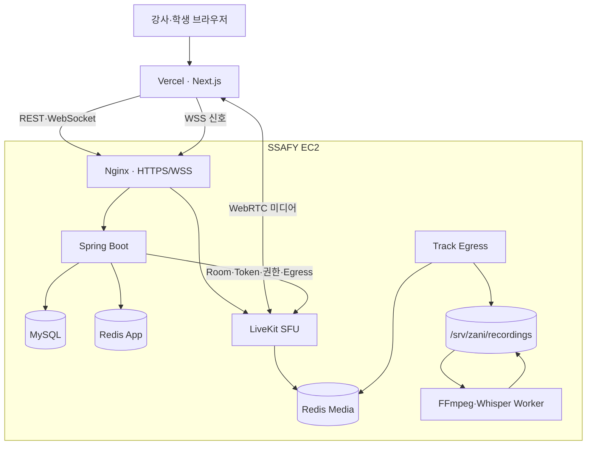
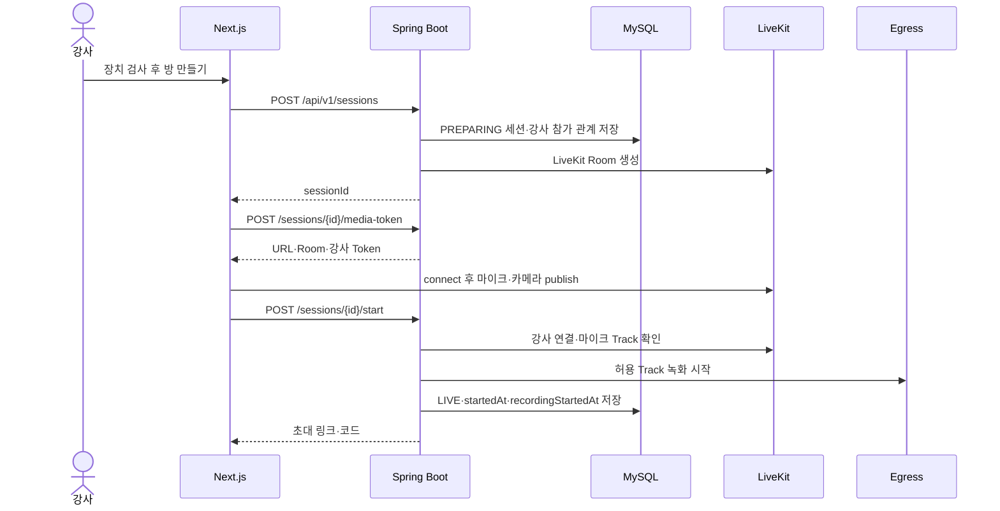
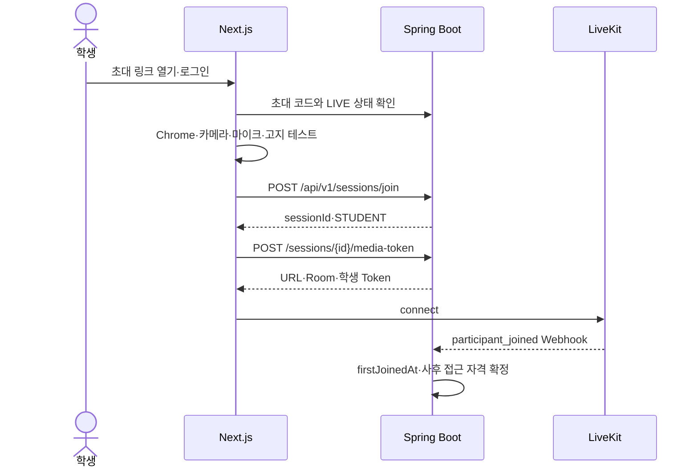
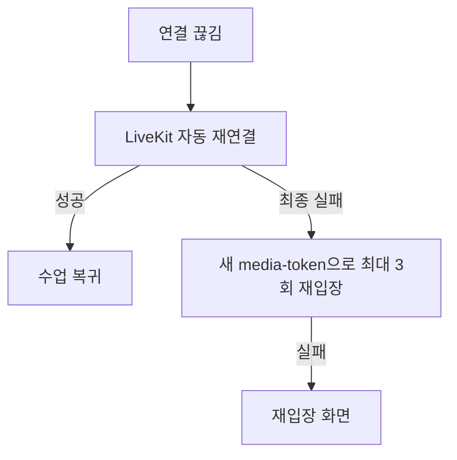
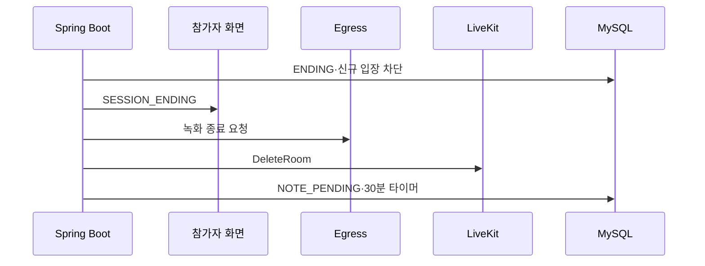
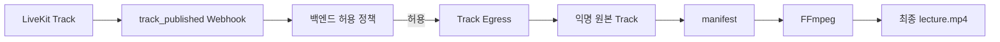

# ZANI LiveKit 연동 개요

## 1. 목적

이 문서는 팀 전체가 ZANI 세션, LiveKit Room, 실시간 미디어, 녹화의 관계를 같은 방식으로 이해하기 위한 개요다.

- 프론트엔드 세부 구현: [livekit-frontend-guide.md](./livekit-frontend-guide.md)
- 백엔드 세부 구현: [livekit-backend-guide.md](./livekit-backend-guide.md)

## 2. 한 문장으로 이해하기

Spring Boot는 **누가 어떤 수업에 어떤 권한으로 들어갈지** 결정하고, LiveKit은 **허가된 참가자의 실시간 미디어를 전달**하며, Egress와 FFmpeg는 **허용된 Track만 저장하고 최종 강의 영상을 만든다**.

## 3. 전체 구조



## 4. 책임 구분

| 구성요소 | 담당 | 담당하지 않는 것 |
| --- | --- | --- |
| Next.js | 장치 테스트, LiveKit SDK, 레이아웃, 사용자 조작 | 역할·grant 결정, Egress 직접 호출 |
| Spring Boot | 로그인, 세션, 참가 관계, 토큰, 권한, Webhook, 녹화 조정 | 미디어 패킷 중계 |
| LiveKit | Room, Participant, Track, SFU, 재연결 | ZANI 회원·초대·DB 업무 규칙 |
| Spring WebSocket | 채팅, 손들기, 반응, 화면 공유 상태, 종료 안내 | 카메라·마이크 전송 |
| Track Egress | 허용된 단일 원본 Track 저장 | 최종 레이아웃 결정 |
| FFmpeg | 종료 후 영상·음성 시간축 정렬과 최종 MP4 | 실시간 통화 |

## 5. 주요 식별자

```text
ZANI Session ID       : DB의 수업 식별자
LiveKit Room name     : zani-{environment}-session-{sessionId}
Participant identity  : p-{sessionParticipantId}
실시간 표시 이름       : ZANI 프로필 표시 이름
녹화 화자 alias        : instructor, student-001, student-002, ...
```

현재 백엔드 코드도 참가 개념을 `SessionParticipant`로 구현한다. LiveKit identity에는 해당 참가 관계의 ID를 그대로 사용한다.

## 6. 강사 수업 생성 시퀀스



`POST /sessions`가 반환됐다는 사실만으로 수업이 시작된 것은 아니다. 강사 미디어와 녹화가 준비된 뒤 `/start`가 성공해야 사용자에게 방 생성 완료로 보인다.

## 7. 학생 입장 시퀀스



- 학생은 카메라와 마이크 테스트를 모두 통과해야 한다.
- API 입장만 하고 LiveKit 연결에 성공하지 않으면 사후 자료 접근 자격을 얻지 않는다.
- 강제 퇴장은 현재 연결만 끊으며 동일 코드로 다시 입장할 수 있다.

## 8. 미디어 권한

| 기능 | 강사 | 학생 |
| --- | ---: | ---: |
| 카메라 | 허용 | 허용 |
| 마이크 | 허용 | 허용 |
| 화면 공유 | 허용 | 허용 |
| 화면 공유 오디오 | 허용 | 허용 |
| Track 구독 | 허용 | 허용 |
| LiveKit Data 전송 | 차단 | 차단 |

화면 공유에 역할 제한을 두지 않는다(2026-07-30 확정). 승인 플로우 없이 누구든 공유를 시작할 수 있고, **한 세션에 활성 공유 하나**라는 제약만 서버의 활성 공유 상태로 강제한다. 기준은 [`livekit-integration-context.md`](./livekit-integration-context.md) §8이 소유한다.

채팅, 손들기, 이모지, 공유 상태와 종료 안내는 LiveKit DataPacket이 아니라 Spring Boot WebSocket을 사용한다.

## 9. 수업 화면 규칙

- 공유 화면이 없으면 참가자 카메라를 그리드로 표시한다.
- 공유 화면이 있으면 공유 화면을 메인으로 표시한다.
- 강사 카메라는 우측 하단 보조 화면으로 표시한다.
- 다른 참가자 카메라는 상단 또는 측면에 표시한다.
- 한 번에 하나의 공유 화면만 허용한다.
- 학생 카메라는 실시간으로 볼 수 있지만 녹화하지 않는다.

## 10. 재연결과 종료



- 재시도 간격은 1초, 2초, 4초다.
- 강사 비정상 이탈 후 5분 동안 Room을 유지한다.
- 강사가 같은 identity로 복귀하면 자동 종료를 취소한다.
- 강사 미복귀, 명시적 종료 또는 3시간 경과 시 같은 종료 절차를 사용한다.



## 11. 녹화 구조



| 원본 | 저장 | 최종 MP4 |
| --- | ---: | ---: |
| 강사 카메라·마이크 | 포함 | 포함 |
| 강사 화면·화면 오디오 | 포함 | 포함 |
| 학생 마이크 | 학생별 익명 파일 | 전체 음성에 혼합 |
| 학생 화면·화면 오디오 | 포함 | 활성 구간 포함 |
| 학생 카메라 | 제외 | 제외 |

학생 오디오는 `student-001`, `student-002`처럼 분리된 원본으로 남는다. 전체 음성 혼합은 최종 MP4 생성 시에만 수행하므로 학생별 전사와 화자 구분이 가능하다.

## 12. 저장 정책

```text
/srv/zani/recordings/{sessionId}/
├── raw/
├── manifest/tracks.json
├── transcript/
└── final/lecture.mp4
```

- S3를 사용하지 않는다.
- 외부 정적 경로로 공개하지 않는다.
- Spring Boot가 로그인·세션 참여·역할을 검사한 후 Nginx 내부 전달로 제공한다.
- 종료 후 90일에 삭제한다.
- EC2 초기화 또는 디스크 장애 시 복구할 수 없다는 운영 제약이 있다.

## 13. 확정된 예외 정책

- 강사를 포함한 일반 참가자는 최대 30명이며 31번째는 `409 SESSION_CAPACITY_REACHED`로 차단한다.
- 초대 코드는 정규화된 8자리이며 표시할 때 `A7KM-2PQR`처럼 하이픈을 넣을 수 있다.
- 미디어 토큰 TTL은 10분이며 브라우저 메모리에만 둔다.
- 종료된 세션에는 새 토큰을 발급하지 않는다.
- 자체 구축 LiveKit에서 남은 토큰으로 종료된 Room이 다시 시작되면 Webhook이 즉시 제거·종료한다.

## 14. 현재 코드와의 차이

- FE에는 `/media-token` 어댑터, `RoomProvider`, `Room.connect`와 SDK 재연결 상태 처리가 구현돼 있다.
- FE의 Track publish/subscribe, 실제 장치 점검, 참가자·미디어 UI는 아직 fixture와 로컬 상태 기반이다.
- BE는 현재 세션 생성 즉시 `LIVE`와 초대 코드를 반환한다.
- BE는 API 입장 시 `firstJoinedAt`을 즉시 저장한다.
- BE의 LiveKit 토큰·Room·Webhook·Egress API는 아직 없다.
- Flyway V1에는 세션·참가자·녹화 테이블이 있지만 목표 상태 전이, nullable 입장 시각, 로컬 저장 정책에는 후속 migration이 필요하다.
- 구현 전 이 문서를 기준으로 OpenAPI 계약을 확정하고 공유된 V1은 수정하지 않은 채 새 Flyway migration을 추가한다.
