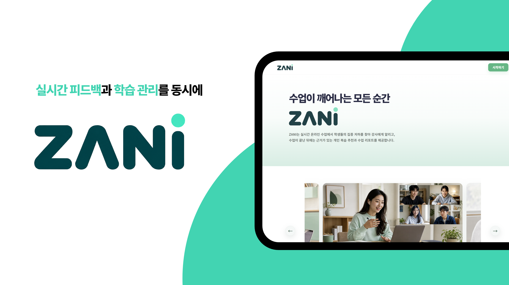
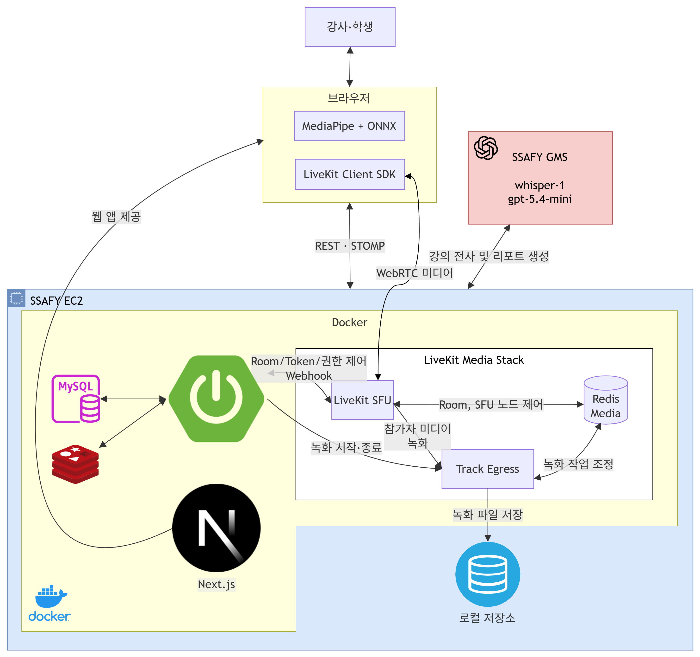
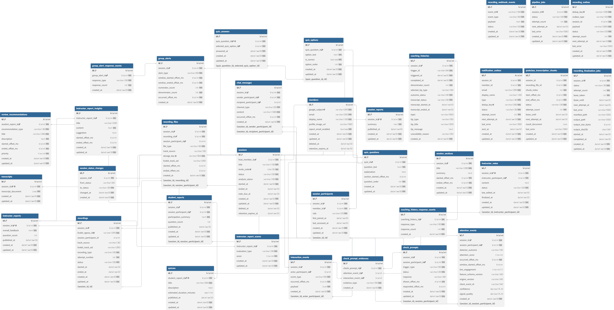
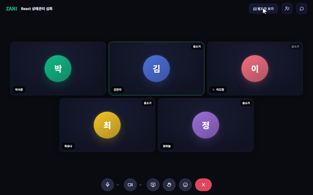
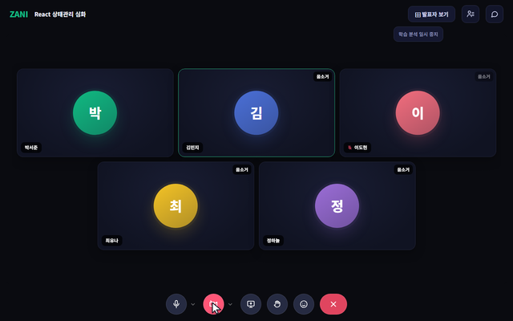
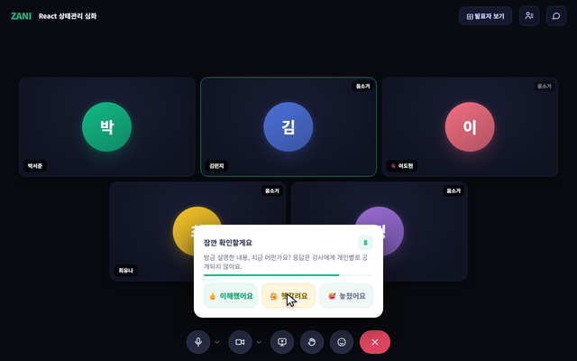
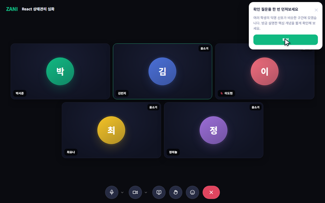
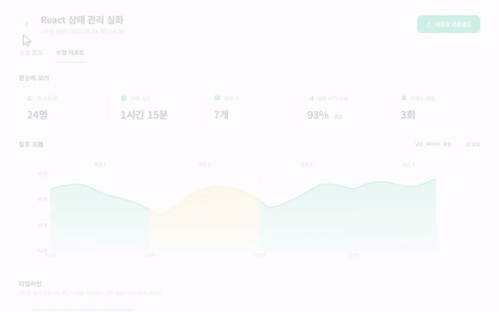
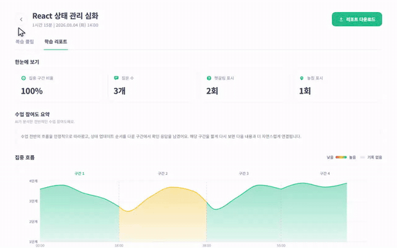

# ZANI

> **비대면 강의에서 학생의 학습 반응을 읽어, 강사에게는 지금 필요한 조언을, 학생에게는 자기 수업의 기록을 남깁니다.**

<br>

## 🎥 ZANI는 이런 서비스입니다

- ZANI는 비대면 강의의 학습 반응을 읽어 강사와 학생 양쪽에 돌려주는 서비스입니다.
- 학생 카메라 영상은 브라우저 안에서만 분석해요. 서버로 올라가는 건 10초마다 나오는 판정 결과 한 줄뿐입니다.
- 흐트러진 학생에게는 조용히 확인 질문을 띄우고, 그 응답을 익명으로 모아 강사에게 "지금 30%가 헷갈려 합니다"를 알립니다.
- 수업이 끝나면 녹화·전사·참여도를 하나의 시간축에 겹쳐, 강사에게는 개선 피드백을 학생에게는 놓친 구간의 복습 클립을 만들어 줍니다.

### 프로젝트 기간

`2026.07.06 ~ 2026.08.14` · SSAFY 15기 자율 프로젝트 · 5인 팀

<br>

## 목차

- [🎥 ZANI는 이런 서비스입니다](#-zani는-이런-서비스입니다)
- [🎓 비대면 강의에서 사라진 신호](#-비대면-강의에서-사라진-신호)
- [🧠 30명의 얼굴을 서버에 올리지 않고 만들기](#-30명의-얼굴을-서버에-올리지-않고-만들기)
  * [WASM에서 1,079.9ms — 예산의 0.93배를 쓰는 모델은 버렸습니다](#wasm에서-10799ms--예산의-093배를-쓰는-모델은-버렸습니다)
  * [강사 목소리 300초를 메모리에만 두고 파일은 만들지 않았습니다](#강사-목소리-300초를-메모리에만-두고-파일은-만들지-않았습니다)
  * [LLM이 없던 구간을 근거로 대던 것](#llm이-없던-구간을-근거로-대던-것)
- [🛠 기술 스택](#-기술-스택)
- [🏗 아키텍처](#-아키텍처)
- [📁 저장소 구조](#-저장소-구조)
- [🗂 ERD](#-erd)
- [📦 실행 방법](#-실행-방법)
- [📖 API 명세](#-api-명세)
- [🧑‍🏫 수업 중에 일어나는 일](#-수업-중에-일어나는-일)
- [👥 팀원](#-팀원)
- [📌 컨벤션](#-컨벤션)
- [🔄 CI/CD](#-cicd)

<br>

## 🎓 비대면 강의에서 사라진 신호

대면 강의에서 강사는 학생들의 표정만 보고도 "지금 안 통했다"를 압니다. 비대면에서는 그 신호가 사라집니다. 카메라를 켜 두어도 30명의 얼굴을 동시에 읽을 수는 없습니다.

학생 쪽도 마찬가지입니다. 이해하지 못했다는 걸 실시간으로 말하기 어렵고, 수업이 끝나면 어디를 다시 봐야 하는지조차 기억나지 않습니다.

그래서 사라진 신호를 되살리기로 했습니다. 다만 조건을 하나 걸었습니다 — **강의실 30명의 얼굴을 서버에 올리는 설계는 만들지 않는다.**

<br>

## 🧠 30명의 얼굴을 서버에 올리지 않고 만들기

> 영상도 목소리도 서버에 남기지 않으면서, 학생에게 사실이 아닌 말을 하지 않기 위해 오래 붙잡았던 것들입니다.

### WASM에서 1,079.9ms — 예산의 0.93배를 쓰는 모델은 버렸습니다

- **막힌 지점**
    - 10초 창을 1초마다 새로 판정하므로 추론에 쓸 수 있는 시간은 1초 미만입니다.
    - 후보 두 개 중 어느 쪽이 교실 노트북에서 버티는지 파일 크기로는 판단할 수 없었습니다. 오히려 작은 쪽이 느렸습니다.
- **해본 것**
    - 두 모델을 execution provider별로 warmup 5회 뒤 30회씩 측정하고, 환경을 Intel Iris Xe 내장 그래픽으로 고정했습니다. 교실 노트북 대부분과 같은 조건입니다.
    - 2회 반복해 재현성을 확인했습니다.
- **결과**

    | 모델 | provider | median | p95 | 1초 예산 대비 |
    | --- | --- | --- | --- | --- |
    | **E0 Transformer** | WebGPU | `6.1ms` | `9.0ms` | 164배 여유 |
    | **E0 Transformer** | WASM | `9.5ms` | `11.2ms` | 105배 여유 |
    | E1 ST-GCN | WebGPU | `84.0ms` | `87.9ms` | 11.9배 |
    | E1 ST-GCN | WASM | `1,079.9ms` | `5,971.6ms` | `0.93배` — 예산 초과 |

    - E1은 파일 크기가 E0의 1/3인데 WASM에서 **114배 느렸습니다.** 병목이 파라미터 수가 아니라 시퀀스 길이 × 노드 수라는 뜻이었습니다.
    - WebGPU가 없는 기기를 최악 조건으로 놓고 E0을 택했습니다.
- 측정 명령과 원자료는 [`ai/README.md`](ai/README.md)의 *추론 속도 실측* 절에 있습니다.

### 강사 목소리 300초를 메모리에만 두고 파일은 만들지 않았습니다

- **막힌 지점**
    - 강사 팁 문구의 `{핵심 개념}`을 채우려면 트리거 직전 강사 발화가 필요합니다.
    - 파일로 떨구면 강의실 음성이 디스크에 남습니다. 학생 영상을 안 보내기로 해 놓고 강사 목소리를 저장하면 앞뒤가 맞지 않습니다.
- **해본 것**
    - LiveKit Track Egress의 WebSocket 출력을 s16le 모노 PCM으로 정규화해 300초 링버퍼에 담았습니다. 컨테이너가 없으니 바이트 수와 재생 시간이 정확히 비례해서, "최근 N초"를 바이트 산술만으로 잘라냅니다.
    - 전사 포트에 넘기고 호출이 끝나면 바이트 참조가 사라집니다. 저장 경로 자체를 두지 않았습니다.
    - 세션마다 마스터 키에서 키를 파생했습니다. 공용 키를 썼다면 남의 강의 버퍼에 PCM을 밀어 넣어 그 강사의 전사를 통째로 오염시킬 수 있습니다.
    - 버퍼를 동시에 드는 세션을 8개로 제한했습니다. 상한이 없으면 OOM 한 번에 진행 중인 강의가 전부 끊깁니다.
- **결과**
    - 확보량이 `60초`에 못 미치면 전사를 시도하지 않고 팁도 보내지 않습니다. 쿨타임도 시작하지 않습니다.
    - 트리거에서 `10초` 넘게 밀린 작업은 버립니다. 300초 창의 `3.3%`가 지난 시점이라, 지금 오디오를 떠도 트리거 당시가 아닌 발화가 섞입니다.
- 버퍼 길이와 전사 기준값은 [`.agents/attention-coaching-context.md`](.agents/attention-coaching-context.md) §9

### LLM이 없던 구간을 근거로 대던 것

- **막힌 지점**
    - 복습 추천을 LLM으로 만들면서, 모델이 관측되지 않은 구간을 근거로 내놓는 일이 있었습니다. "12분 구간에서 응답하지 않았다"는데 그 구간에 그 학생의 관측이 없는 식입니다. 학생에게 사실이 아닌 말을 하게 됩니다.
    - 길이 가드는 이스케이프 이전 문자열로 재고 있었습니다. 가드를 통과한 응답이 실제 전송에서는 상한을 넘었습니다.
- **해본 것**
    - 응답 전체를 버리지 않고 **근거가 맞지 않는 항목만** 뺐습니다. 남은 항목의 시각은 실제 개념 구간의 시작·종료로 바꿉니다.
    - 유형별 상한을 넘는 항목은 지우지 않고 순서만 내렸습니다. 지우면 근거가 한 유형에 몰린 학생만 추천을 덜 받습니다.
    - 계약에 없는 enum 값은 집계에서 세지 않고 버립니다. 오타 하나가 학생에게 "응답하지 않은 구간"이라고 잘못 말하는 것을 막습니다.
    - 길이 가드를 실제 전송 형태, 그러니까 이스케이프 이후 기준으로 다시 쟀습니다.
- **결과**
    - 근거 없는 항목만 사라지고 나머지 추천은 남습니다. 추천 개수가 근거 유형 분포에 따라 불공평해지던 것도 함께 풀렸습니다.
    - 같은 방식으로, 인사이트 한 장이 비었다고 강사 리포트 전체를 버리던 것과 세그먼트 하나의 타임스탬프로 세션 전체가 실패하던 것을 고쳤습니다.
- 관련 티켓 — `S15P11A105-249` `-250` `-332` `-333` `-334`

<br>

## 🛠 기술 스택

| 역할 | 종류 |
| --- | --- |
| 프런트엔드 |    |
| 상태·데이터 |   |
| 백엔드 |    |
| 데이터베이스 |    |
| 실시간 미디어 |   · STOMP over WebSocket |
| AI |     |
| 인프라·CI/CD |     |
| 협업 |     |

참여도 4단계 분류 모델은 EngageNet으로 학습해 브라우저 추론용 ONNX로 배포합니다. 전사와 생성형 분석은 SSAFY GMS(whisper-1 · LLM)를 씁니다.

<br>

## 🏗 아키텍처



미디어는 LiveKit SFU를 지나고, 판정은 학생 브라우저에서 끝납니다. 서버가 받는 것은 10초마다 오는 판정 결과와, 강사 마이크 트랙의 PCM 스트림뿐입니다.

프런트엔드는 Vercel에, 나머지는 SSAFY EC2 한 대에 컨테이너로 올립니다. 녹화 파일은 오브젝트 스토리지를 쓰지 않고 EC2 로컬에 두고, 권한 검사를 거쳐 Nginx 내부 전달로 내보냅니다.

<br>

## 📁 저장소 구조

```text
├── fe/                     Next.js. app 라우트와 domains 아래 도메인별 4계층
│   └── src/domains/        attention · auth · interaction · lecture · report · user
├── backend/                Spring Boot 모듈러 모놀리식. 도메인마다 4계층으로 끊음
│   └── src/main/java/com/a105/zani/
│       ├── attention/      참여도 판정 결과 수집과 집계
│       ├── audioclip/      강사 마이크 링버퍼. 저장 경로 없음
│       ├── coach/          실시간 강사 팁 생성과 쿨타임
│       ├── recording/      LiveKit Egress 오케스트레이션, outbox
│       ├── postclass/      전사 → 공통 분석 → 학생·강사 분석 파이프라인
│       ├── report/         리포트 조회와 공개 게이트
│       └── session/        강의실 수명주기와 참가자 로스터
├── ai/                     참여도 모델 학습·평가·ONNX 배포
│   ├── src/zani_ai/        전처리, 학습, 평가 진입점
│   └── web/                브라우저 추론 자산
├── infrastructure/         Docker Compose, Jenkins, 녹화 후처리 워커, 로컬 스택
├── code-review/            MR 자동 검토 도구
└── .agents/                기획·요구사항·설계 문서 (목록은 AGENTS.md)
```

<br>

## 🗂 ERD



테이블 27개를 Flyway로 관리합니다. 마이그레이션은 [`backend/src/main/resources/db/migration`](backend/src/main/resources/db/migration), 스키마 정의는 [`docs/erd.dbml`](docs/erd.dbml)에 있습니다.

| 테이블 | 담는 것 |
| --- | --- |
| `members` · `sessions` · `session_participants` | 계정, 강의실, 누가 언제 들어왔는지 |
| `attention_events` | 브라우저가 10초마다 올린 참여 단계 판정 |
| `check_prompts` · `check_prompt_evidences` | 학생에게 띄운 확인 질문과 그 근거 |
| `group_alerts` · `group_alert_response_counts` | 강사에게 나간 익명 집계 알림 |
| `coaching_history` | 팁 발송 이력과 쿨타임 |
| `recordings` · `recording_files` · `recording_outbox` | 트랙별 녹화와 Egress 진행 상태 |
| `transcripts` · `postclass_transcription_chunks` | 전사 원문과 청크 |
| `session_reports` · `session_sections` | 수업 공통 분석과 개념 구간 |
| `student_reports` · `review_recommendations` · `quizzes` | 학생 리포트, 복습 추천, 퀴즈 |
| `instructor_reports` · `instructor_report_insights` · `instructor_report_tips` | 강사 리포트와 분야별 평가 |

<br>

## 📦 실행 방법

**사전 준비**: Java 21, Node.js 20+, Python 3.12+, MySQL, Redis, Google OAuth 웹 클라이언트 ID (승인된 원본에 `http://localhost:3000`)

```bash
# 1. 백엔드 환경값을 넣는다
#    DB_URL · DB_USERNAME · DB_PASSWORD · JWT_SECRET · GOOGLE_OAUTH_CLIENT_ID
#    GMS_API_KEY · GMS_BASE_URL · LIVEKIT_URL · LIVEKIT_API_KEY · LIVEKIT_API_SECRET
#    전체 목록은 docs/environment-variables.md
cd backend && ./gradlew bootRun          # Windows 는 gradlew.bat

# 2. 프런트엔드 (.env.local 에 NEXT_PUBLIC_API_BASE_URL, NEXT_PUBLIC_GOOGLE_CLIENT_ID)
cd fe && npm install && npm run dev

# 3. 참여도 모델 쪽만 만질 때
cd ai && uv sync --all-extras && uv run zani-ai --help
```

| 확인 | URL |
| --- | --- |
| 웹 | http://localhost:3000 |
| 백엔드 헬스체크 | http://localhost:8080/actuator/health |
| Swagger UI | http://localhost:8080/swagger-ui.html |

GMS 키가 없으면 `GMS_MOCK_ENABLED=true` 로 전사·분석을 목으로 돌릴 수 있습니다. 실시간 미디어는 LiveKit 서버가 따로 필요하고, 녹화 후처리 워커와 Nginx 구성은 [`infrastructure/`](infrastructure/)에 있습니다. 환경변수는 [`docs/environment-variables.md`](docs/environment-variables.md)가 정본입니다.

<br>

## 📖 API 명세

- [Swagger UI](http://localhost:8080/swagger-ui.html) — springdoc으로 생성합니다. Google 로그인으로 받은 JWT를 `Authorization: Bearer` 로 넣으면 인증이 필요한 엔드포인트도 호출됩니다.

<br>

## 🧑‍🏫 수업 중에 일어나는 일

<table align="center">
<tr>
  <td></td>
  <td></td>
</tr>
<tr>
  <td align="center">카메라를 켜면 브라우저가 알아서 참여 상태를 재요. 서버로 가는 건 10초마다 판정 한 줄뿐이에요.</td>
  <td align="center">카메라를 끄면 분석도 멈춰요.</td>
</tr>
<tr>
  <td></td>
  <td></td>
</tr>
<tr>
  <td align="center">저참여가 3연속, 그러니까 30초 이어질 때만 조용히 떠요. 응답은 강사에게 개인별로 가지 않아요.</td>
  <td align="center">"여러 학생의 익명 신호가 비슷한 구간에 모였습니다." 누가 그랬는지는 끝까지 보이지 않아요.</td>
</tr>
<tr>
  <td></td>
  <td></td>
</tr>
<tr>
  <td align="center">강사 리포트 — 구간별 집중 흐름과 분야별 평가. 개별 학생의 데이터는 없어요.</td>
  <td align="center">학생 리포트 — 자기 참여도 흐름, 놓친 구간의 복습 클립, 수업 내용 기반 퀴즈. 남과 비교하지 않아요.</td>
</tr>
</table>

위 화면은 전부 `npm run record:landing`으로 실제 프런트엔드를 띄워 자동 캡처한 것입니다. 개인정보가 없는 데모 응답을 물려 두었고, 조작 순서는 [`fe/recording/landing-demos.spec.ts`](fe/recording/landing-demos.spec.ts)에 있습니다.

<br>

## 👥 팀원

| 박상은 | 김용휘 | 김태정 | 양지훈 | 엄기훈 |
| :---: | :---: | :---: | :---: | :---: |
| 팀장 | 팀원 | 팀원 | 팀원 | 팀원 |

<br>

## 📌 컨벤션

### 브랜치

- `[<플랫폼>/]<타입>/<설명>-<지라키>` 형태로 만들기 — `be/fix/assembly-never-fails-on-timestamps-S15P11A105-330`
- 플랫폼은 `fe` `be` `ai` 중 선택, 없어도 됨
- 지라 키는 항상 맨 뒤에 붙이기

### 커밋

- `<gitmoji> <type>: <설명> (지라키)` — `✨ feat: 로그인 페이지 UI 구현 (S15P11A105-123)`
- type은 반드시 소문자
- 브랜치 이름에 지라 키가 있으면 훅이 자동으로 채워 줌

<details>
<summary>Gitmoji ↔ type 매핑 15종</summary>

| Gitmoji | Type | 의미 |
|---|---|---|
| ✨ | feat | 새로운 기능 추가 |
| 🐛 | fix | 버그 수정 |
| 📝 | docs | 문서 추가/수정 |
| 💄 | style | 로직 변경 없는 스타일/포맷팅 |
| ♻️ | refactor | 리팩토링 |
| ✅ | test | 테스트 코드 추가/수정 |
| 🔧 | chore | 설정, 빌드, 패키지 매니저 |
| ⚡️ | perf | 성능 개선 |
| 🔥 | remove | 코드/파일 삭제 |
| 🚑 | hotfix | 긴급 수정 |
| 🚀 | deploy | 배포 관련 |
| 🔀 | merge | 브랜치 병합 |
| ⏪ | revert | 되돌리기 |
| 🎉 | init | 최초 세팅 |
| 🎨 | design | UI/디자인 작업 |

</details>

### Merge Request

- 기능·버그 브랜치는 `dev`로 올리기, `main`은 배포 시점에만 머지
- 리뷰어 최소 1인 지정하고 승인 후 머지
- Squash 후 머지, 소스 브랜치 삭제
- 설명의 "관련 이슈"에 지라 링크 반드시 넣기

전문은 [`.gitlab/CONTRIBUTING.md`](.gitlab/CONTRIBUTING.md)에 있습니다.

<br>

## 🔄 CI/CD

Jenkins 파이프라인 세 개가 GitLab 웹훅으로 물려 있습니다.

| 파이프라인 | 트리거 | 동작 |
| --- | --- | --- |
| `Jenkinsfile` | `dev` push 웹훅 | 웹훅 SHA를 검증하고 변경 경로를 분류해 컴포넌트 잡을 띄움 |
| `Jenkinsfile.deploy` | 디스패치 잡 호출 | 요청 커밋을 체크아웃해 해당 컴포넌트만 빌드·배포 |
| `Jenkinsfile.review` | `dev` 대상 MR 웹훅 | Git 컨벤션·DDD 경계 위반을 기계 검사하고, Claude Code가 중복 구현과 재사용 가능한 컴포넌트를 댓글로 남김 |

<br>

## 문서

기획·요구사항·설계 문서는 `.agents/`에 있습니다. 전체 목록과 각 문서를 언제 읽어야 하는지는 [`AGENTS.md`](AGENTS.md)의 Document Registry에 정리돼 있습니다.

| 문서 | 내용 |
| --- | --- |
| [`.agents/prd.md`](.agents/prd.md) | 제품 정의, 사용자, 목표, 범위 |
| [`.agents/frd.md`](.agents/frd.md) | 기능 요구사항. 이 README의 기능 설명은 요약이며 **정본은 이쪽입니다** |
| [`.agents/attention-coaching-context.md`](.agents/attention-coaching-context.md) | 참여도 판정·프롬프트·강사 팁의 모든 수치와 근거 |
| [`ai/README.md`](ai/README.md) | 학습 프로토콜 전체 기록. 기각된 실험도 남아 있습니다 |

회의록·기획서·회고는 [Notion](https://periwinkle-ostrich-9de.notion.site/396a48a2c68680d8a023d35a50a7c45b?source=copy_link), 스프린트와 이슈는 [Jira](https://ssafy.atlassian.net/jira/software/c/projects/S15P11A105/)에서 관리했습니다.

<!-- 남은 작업
  - [ ] 팀원 담당 영역 — 각자 한 줄씩 받아 팀원 표에 행 추가
  - [ ] 팀원 GitHub 계정 — 받으면 아바타 행과 프로필 링크 추가
-->
