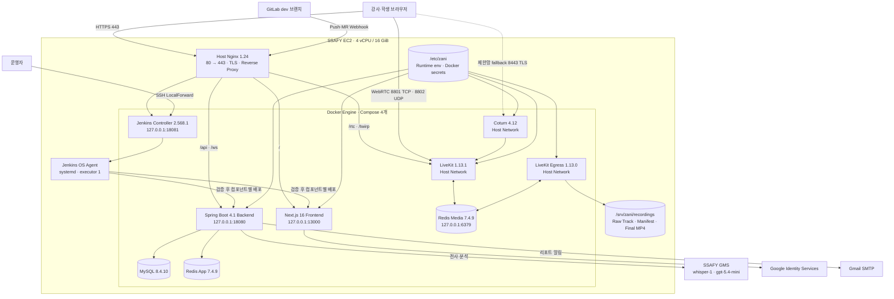

# ZANI 포팅 매뉴얼

> 기준 일자: 2026-08-08
>
> 운영 주소: `https://i15a105.p.ssafy.io`

이 문서는 ZANI 소스 코드를 빌드하고 새 서버에 배포하거나, 현재 SSAFY EC2 운영 환경을 재현하기 위한 정본이다. 실제 비밀번호·API 키·Webhook 토큰·JWT 서명 키는 포함하지 않는다.

## 1. 함께 제출하는 파일

| 파일 | 목적 |
| --- | --- |
| `exec/README.md` | 제출 산출물 랜딩 페이지와 문서 목차 |
| `exec/01-porting-manual/porting-manual.md` | 빌드·배포·환경 설정·복구 절차 |
| `exec/01-porting-manual/environment-variables.md` | 전체 환경변수·운영값·Docker secret 주입 명세 |
| `exec/02-external-services/external-services.md` | Google OAuth, SSAFY GMS, SMTP 등 외부 서비스 설정 |
| `exec/03-db-dump/zani-schema.sql` | Flyway V1~V20을 적용한 최신 DB 구조 덤프 |
| `exec/04-demo-scenario/demo-scenario.md` | 시연 시나리오 PDF·Figma 원본 안내 |

## 2. 시스템 구성



### 2.1 Compose 프로젝트와 컨테이너

| Compose 프로젝트 | 컨테이너 | 공개 범위 |
| --- | --- | --- |
| `zani-frontend` | `zani-frontend` | `127.0.0.1:13000`만 호스트 공개 |
| `zani-application` | `zani-backend`, `zani-mysql`, `zani-redis-app` | 백엔드만 `127.0.0.1:18080`, DB·Redis는 내부 네트워크 |
| `zani-media` | `zani-livekit`, `zani-egress`, `zani-coturn`, `zani-redis-media` | LiveKit·Egress·Coturn은 host network |
| `zani-jenkins` | `zani-jenkins-controller` | `127.0.0.1:18081`만 호스트 공개 |

`zani-jenkins-agent`는 컨테이너가 아니라 호스트 systemd 서비스다. Jenkins Controller의 executor는 `0`, OS Agent의 executor는 `1`이다.

## 3. 기술 스택과 버전

| 구분 | 버전·구성 |
| --- | --- |
| Frontend | Node.js 22 Alpine, npm lockfile v3, Next.js 16.2.10, React 19.2.4, TypeScript 5, Tailwind CSS 4, Zustand 5, TanStack Query 5, Vitest 4 |
| Browser AI | MediaPipe Tasks Vision 0.10.35, ONNX Runtime Web 1.27.0 |
| JVM·WAS | Eclipse Temurin 21.0.11+10, Spring Boot 4.1.0, 내장 Apache Tomcat 11.0.22 |
| Backend | Gradle Wrapper 9.5.1, Spring Security, JPA, Flyway, WebSocket |
| AI | Python 3.12, PyTorch 2.7+, MediaPipe, ONNX, ONNX Runtime |
| DB | 운영 MySQL 8.4.10, Redis 7.4.9, Flyway V1~V20 |
| Media | LiveKit Server 1.13.1, LiveKit Egress 1.13.0, Coturn 4.12.0, FFmpeg/ffprobe |
| Infra | Ubuntu, Nginx 1.24.0, Docker 29.6.2, Docker Compose 5.3.1, Jenkins 2.568.1-jdk21 |
| CI/CD | GitLab Webhook, Jenkins Controller + OS Agent, immutable Git SHA release |
| IDE | Visual Studio Code 1.128.1, IntelliJ IDEA Ultimate 2023.3.8 |

IDE는 개발에 사용했지만 빌드 계약에는 포함하지 않는다. 제출·배포 재현의 정본은 아래 CLI 명령과 Java·Node.js·Python 버전이다.

## 4. 저장소 구조

```text
backend/                    Spring Boot 애플리케이션
  src/main/resources/
    application.yaml       local/dev/prod 설정
    db/migration/           Flyway V1~V20
    db/seed/                local/dev 시연 데이터
fe/                         Next.js 프론트엔드
ai/                         참여도 모델 학습·검증·ONNX 산출
infrastructure/
  application/             MySQL·Redis App·Backend Compose와 배포 Wrapper
  frontend/                Frontend Compose와 배포 Wrapper
  jenkins/                 Controller·Agent·Webhook·Job 정의
  media/                   FFmpeg 최종화 Worker
.agents/                    제품·기능·LiveKit·DB 설계 문서
exec/                       제출용 포팅 매뉴얼·덤프·시연 자료
```

운영 `zani-media` Compose와 LiveKit/Egress/Coturn 비밀 설정은 보안상 저장소에 넣지 않고 서버 `/opt/zani/media`, `/etc/zani/media`에서 관리한다.

## 5. 로컬 빌드와 실행

### 5.1 사전 요구사항

- Git
- Docker Desktop 또는 Docker Engine
- Java 21
- Node.js 22와 npm
- Python 3.12와 `uv`(AI 작업 시)

### 5.2 로컬 MySQL·Redis

저장소 루트에서 실행한다.

```bash
docker compose -f backend/infra/compose/local.yml up -d
docker compose -f backend/infra/compose/local.yml ps
```

기본값은 다음과 같다.

| 항목 | 값 |
| --- | --- |
| MySQL | `localhost:3306`, DB `zani`, 사용자 `root`, 비밀번호 `root` |
| Redis | `localhost:6379`, 비밀번호 없음 |

로컬 Compose의 MySQL은 `9.7.1`이지만 운영과 구조 덤프 검증은 `8.4.10`을 기준으로 한다.

### 5.3 Backend

```bash
cd backend
./gradlew spotlessCheck test bootJar
./gradlew bootRun
```

Windows PowerShell에서는 `./gradlew.bat`을 사용한다. 기본 `local` 프로필은 Flyway migration과 `db/seed/R__demo_seed.sql`을 적용한다.

로컬 기본 주소:

- API: `http://localhost:8080`
- Actuator: `http://localhost:8080/actuator/health`
- Swagger: `http://localhost:8080/swagger-ui.html`

### 5.4 Frontend

```bash
cd fe
npm ci
npm run lint
npm run test
npm run build
npm run dev
```

로컬 기본 주소는 `http://localhost:3000`이다. Google 로그인을 실제로 시험하려면 빌드/실행 환경에 `NEXT_PUBLIC_GOOGLE_CLIENT_ID`가 필요하다.

### 5.5 AI

```bash
cd ai
uv sync --all-extras
uv run pytest
uv run zani-ai --help
```

운영 서버는 AI 학습 서버가 아니다. 학습 완료 모델은 프론트엔드 정적 자산으로 포함되어 브라우저에서 실행된다.

### 5.6 빌드 산출물

| 구성 | 산출물 | 운영 사용 방식 |
| --- | --- | --- |
| Backend | `backend/build/libs/ZANI-0.0.1-SNAPSHOT.jar` | `backend/Dockerfile` runtime image에 포함 |
| Frontend | `fe/.next/standalone`, `fe/.next/static` | `fe/Dockerfile` standalone Node image에 포함 |
| 참여도 모델 | `fe/assets/attention-model/v1/engagement.onnx` | Frontend build 전 sync되어 브라우저 ONNX Runtime에서 실행 |
| 녹화 최종화 | `infrastructure/media/finalize-recording.sh`, `finalize_recording.py` | Backend image `/app/media`에 포함 |

운영 배포는 jar나 `.next` 디렉터리를 서버에 직접 복사하지 않고 Jenkins가 검증한 Git SHA에서 Docker image를 생성한다.

## 6. 운영 서버 준비

### 6.1 DNS·TLS

- 운영 도메인: `i15a105.p.ssafy.io`
- 공인 IPv4: 운영 EC2 주소로 A 레코드 연결
- 인증서: Let's Encrypt
- 인증서 경로:
  - `/etc/letsencrypt/live/i15a105.p.ssafy.io/fullchain.pem`
  - `/etc/letsencrypt/live/i15a105.p.ssafy.io/privkey.pem`
- Nginx가 80을 443으로 리다이렉트한다.

### 6.2 포트

| 포트 | 프로토콜 | 용도 | 비고 |
| --- | --- | --- | --- |
| 22 | TCP | SSH | 운영자 접근 |
| 80 | TCP | HTTP | 443 redirect, ACME |
| 443 | TCP | HTTPS/WSS | Nginx 단일 진입점 |
| 7880 | TCP | LiveKit signal 내부 upstream | Nginx `/rtc`, `/twirp` |
| 8801 | TCP | WebRTC ICE TCP | 브라우저 직접 연결 |
| 8802 | UDP | WebRTC ICE UDP | 브라우저 직접 연결 |
| 8443 | TCP | TURN/TLS | 제한망 fallback |
| 8500~8799 | UDP | TURN relay | Coturn 할당 범위 |

`13000`, `18080`, `18081`, Media Redis `6379`는 loopback에만 바인딩한다. MySQL과 Application Redis는 Docker 내부 네트워크에서만 접근한다.

### 6.3 운영 디렉터리

```text
/opt/zani/application/          Backend immutable releases
/opt/zani/frontend/             Frontend immutable releases
/opt/zani/jenkins/controller/   Jenkins Controller 설정
/opt/zani/deploy/               root-owned 배포 Wrapper
/etc/zani/application/          런타임 설정·애플리케이션 secrets
/etc/zani/media/                LiveKit·Egress·Coturn·Redis Media 설정
/etc/zani/jenkins/              Jenkins·Agent secrets
/srv/zani/recordings/           녹화 원본·manifest·최종 MP4
/srv/zani/redis-media/          Media Redis 영속 데이터
```

녹화 저장소는 S3·MinIO가 아니라 EC2 로컬 디스크다. 학생 카메라는 녹화하지 않고, 강사 화면 공유·카메라·마이크와 학생별 익명 마이크 트랙만 저장한다.

## 7. 비밀정보와 환경 변수

### 7.1 파일 위치

다음 파일은 Git에 커밋하지 않는다.

```text
/etc/zani/application/runtime.env
/etc/zani/application/secrets/mysql_root_password
/etc/zani/application/secrets/mysql_app_password
/etc/zani/application/secrets/redis_app_password
/etc/zani/application/secrets/jwt_secret
/etc/zani/application/secrets/livekit_api_key
/etc/zani/application/secrets/livekit_api_secret
/etc/zani/application/secrets/gms_api_key
/etc/zani/application/secrets/smtp_password
/etc/zani/media/livekit.yaml
/etc/zani/media/egress.yaml
/etc/zani/media/coturn.conf
/etc/zani/media/coturn-shared-secret
/etc/zani/media/redis.conf
/etc/zani/jenkins/secrets/*
/etc/zani/jenkins/agent/JENKINS_AGENT_SECRET
```

비밀번호를 문서·명령행 인자·GitLab 변수 설명에 직접 남기지 않는다. 저장소의 설치 스크립트가 제공되는 GMS·SMTP 비밀번호는 대화형 입력으로 설치한다.

```bash
bash infrastructure/application/install-gms-api-key.sh
bash infrastructure/application/install-smtp-password.sh
```

애플리케이션 컨테이너는 다음 secret을 `/run/secrets/*`에서 읽어 Spring 환경변수로 내보낸다. 실제 값은 포팅 매뉴얼이나 `runtime.env`에 적지 않는다.

| EC2 secret 파일 | 컨테이너 환경변수 | 비고 |
| --- | --- | --- |
| `mysql_app_password` | `DB_PASSWORD` | MySQL 애플리케이션 계정 |
| `redis_app_password` | `REDIS_PASSWORD` | Application Redis 인증 |
| `jwt_secret` | `JWT_SECRET` | JWT 서명 키 |
| `livekit_api_key` | `LIVEKIT_API_KEY` | Backend·Egress가 같은 쌍 사용 |
| `livekit_api_secret` | `LIVEKIT_API_SECRET` | Backend·Egress가 같은 쌍 사용 |
| `gms_api_key` | `GMS_API_KEY` | 없거나 비어 있으면 Backend 기동 실패 |
| `smtp_password` | `SPRING_MAIL_PASSWORD` | 이메일 기능을 켰을 때만 필수 |

### 7.2 `/etc/zani/application/runtime.env`

필드명은 `infrastructure/application/runtime.env.example`을 따른다.

```dotenv
FRONTEND_ORIGIN=https://i15a105.p.ssafy.io
GOOGLE_OAUTH_CLIENT_ID=<Google Web Client ID>
GMS_MOCK_ENABLED=false
COACHING_TRIGGER_COOLDOWN=PT10M
COACHING_TRIGGER_THRESHOLD=0.30
ATTENTION_TIMELINE_MINIMUM_ELIGIBLE=5
ATTENTION_TIMELINE_FOCUS_COVERAGE_FLOOR=0.7
ATTENTION_TIMELINE_REQUIRED_CONNECTION=PT1M
RECORDING_MEDIA_URL_TEMPLATE=https://i15a105.p.ssafy.io/api/v1/sessions/{sessionId}/media
RECORDING_THUMBNAIL_URL_TEMPLATE=https://i15a105.p.ssafy.io/api/v1/sessions/{sessionId}/thumbnail
POSTCLASS_TRANSCRIPTION_HALLUCINATION_FILTER_ENABLED=true
POSTCLASS_TRANSCRIPTION_NO_SPEECH_THRESHOLD=0.98
POSTCLASS_TRANSCRIPTION_REPEATED_PHRASE_FILTER_ENABLED=true
NOTIFICATION_EMAIL_ENABLED=true
NOTIFICATION_EMAIL_FROM=<발신 Gmail 주소>
NOTIFICATION_APP_BASE_URL=https://i15a105.p.ssafy.io
SPRING_MAIL_HOST=smtp.gmail.com
SPRING_MAIL_PORT=587
SPRING_MAIL_USERNAME=<발신 Gmail 주소>
SPRING_MAIL_PROPERTIES_MAIL_SMTP_AUTH=true
SPRING_MAIL_PROPERTIES_MAIL_SMTP_STARTTLS_ENABLE=true
```

`GOOGLE_OAUTH_CLIENT_ID`는 비밀키가 아니라 공개 식별자다. 동일한 값이 Backend 검증용과 Frontend 빌드의 `NEXT_PUBLIC_GOOGLE_CLIENT_ID`로 사용된다. 환경 변수 변경은 컨테이너 재시작이 아니라 새 release 배포로 반영한다.

전체 변수의 코드 기본값, 운영 Compose 값, 필수 여부와 용도는 [`environment-variables.md`](environment-variables.md)를 따른다. 특히 애플리케이션 기본 경로와 운영 컨테이너 경로를 구분한다. 운영 Compose에서는 `RECORDING_BASE_PATH=/out`, `RECORDING_MEDIA_ROOT=/recordings`, `POSTCLASS_SOURCE_ROOT=/out`, `RECORDING_FINALIZATION_OUTPUT_ROOT=/finalized`를 사용한다.

## 8. Nginx 라우팅

운영 Nginx는 호스트 systemd 서비스다. 컨테이너로 실행하지 않는다.

| 경로 | Upstream | 역할 |
| --- | --- | --- |
| `/` | `127.0.0.1:13000` | Next.js |
| `/api/` | `127.0.0.1:18080` | Spring Boot API |
| `/ws` | `127.0.0.1:18080` | STOMP WebSocket, read/send 3600s |
| `/swagger-ui/`, `/v3/api-docs` | `127.0.0.1:18080` | API 문서 |
| `/rtc`, `/twirp/` | `127.0.0.1:7880` | LiveKit WSS/Twirp |
| `/project/zani-dev-dispatch` | `127.0.0.1:18081` | GitLab Push Webhook |
| `/project/zani-mr-review` | `127.0.0.1:18081` | GitLab MR Webhook |
| `/healthz` | Nginx | Edge health |

설정 변경은 반드시 아래 순서를 따른다.

```bash
sudo nginx -t
sudo systemctl reload nginx
```

## 9. Media Stack

Media Stack은 서버에서 수동 관리한다.

| 서비스 | 핵심 설정 |
| --- | --- |
| LiveKit | `port: 7880`, `tcp_port: 8801`, `udp_port: 8802`, `use_external_ip: true`, Redis `127.0.0.1:6379` |
| LiveKit 내장 TURN | 비활성화 |
| Coturn | TLS `8443`, relay UDP `8500~8799`, realm `i15a105.p.ssafy.io`, shared-secret 인증 |
| Egress | LiveKit `ws://127.0.0.1:7880`, Redis Media, `/srv/zani/recordings/track-egress:/out` |
| Redis Media | `127.0.0.1:6379`, 비밀번호 필수, Application Redis와 분리 |

LiveKit·Egress·Coturn은 host network를 사용한다. LiveKit API key/secret은 Backend와 Egress가 동일한 쌍을 사용하고 Coturn은 별도의 shared secret을 사용한다.

## 10. CI/CD 배포

### 10.1 GitLab Webhook

| Webhook | 이벤트 | Jenkins Job |
| --- | --- | --- |
| `/project/zani-dev-dispatch` | `dev` Push events | `zani-dev-dispatch` |
| `/project/zani-mr-review` | Merge request events | `zani-mr-review` |

두 Webhook은 HTTPS 443 POST만 허용하며 같은 inbound Webhook secret을 사용한다. 저장소 read token, review API token, Webhook secret은 서로 분리한다.

### 10.2 변경 경로 분류

| 변경 경로 | 실행 Job |
| --- | --- |
| `backend/**`, `infrastructure/application/**`, 최종화 worker | `zani-backend-dev` |
| `fe/**`, `infrastructure/frontend/**` | `zani-frontend-dev` |
| 양쪽 모두 | 단일 Agent에서 순차 실행 |
| 문서·AI만 변경 | 배포 생략 |

### 10.3 Backend 배포

1. Webhook의 정확한 `dev` SHA checkout
2. Spotless, JUnit, `bootJar` 검증
3. 임시 MySQL·Redis로 통합 테스트
4. `zani/backend:git-<short-sha>` 이미지 생성
5. `zani-backend`만 재생성
6. Docker health와 Actuator health 확인
7. 성공 후 `/opt/zani/application/current` 전환

Jenkins는 root-owned Wrapper만 sudo로 호출한다.

```bash
sudo /opt/zani/deploy/deploy-application status
sudo /opt/zani/deploy/deploy-application rollback
```

### 10.4 Frontend 배포

1. `npm ci`, ESLint, Vitest, Next production build
2. `zani/frontend:git-<short-sha>` 이미지 생성
3. `zani-frontend`만 재생성
4. loopback HTTP 200과 Docker health 확인
5. 성공 후 `/opt/zani/frontend/current` 전환

```bash
sudo /opt/zani/deploy/deploy-frontend status
sudo /opt/zani/deploy/deploy-frontend rollback
```

### 10.5 Jenkins 접속

Jenkins 8080/18081은 외부에 공개하지 않는다.

```bash
ssh -L 18081:127.0.0.1:18081 zani
```

브라우저에서 `http://127.0.0.1:18081`을 열고 로그인한다.

## 11. DB

- 운영 DB: MySQL 8.4.10, Docker 내부 hostname `mysql`, port `3306`
- DB 이름: `zani`
- 애플리케이션 사용자: `zani`
- 비밀번호 정본: `/etc/zani/application/secrets/mysql_app_password`
- Root 비밀번호 정본: `/etc/zani/application/secrets/mysql_root_password`
- Hibernate: `ddl-auto=validate`
- Flyway: V1~V20, `clean-disabled=true`, `out-of-order=false`
- `dev` 프로필은 시연용 repeatable seed를 함께 적용한다.

비밀번호는 포팅 매뉴얼이나 DB 덤프에 포함하지 않는다. 최신 구조는 [`../03-db-dump/zani-schema.sql`](../03-db-dump/zani-schema.sql)을 사용한다.

## 12. 정상 동작 검증

```bash
# EC2
sudo docker compose ls
sudo docker ps
sudo nginx -t
systemctl is-active nginx
systemctl is-active zani-jenkins-agent
curl -fsS http://127.0.0.1:18080/actuator/health
curl -fsS -o /dev/null -w '%{http_code}\n' http://127.0.0.1:13000/
curl -kfsS -o /dev/null -w '%{http_code}\n' https://i15a105.p.ssafy.io/healthz
```

기대값은 Backend `UP`, Frontend `200`, Edge health `200`이다. Media는 브라우저 두 명으로 실제 송수신과 TURN fallback을 검증한다.

전체 사용자 시나리오는 [`../04-demo-scenario/demo-scenario.md`](../04-demo-scenario/demo-scenario.md)를 따른다.

## 13. 복구와 주의사항

- SSH 키·UFW·시스템 디렉터리 권한은 임의 변경하지 않는다.
- Nginx, MySQL/Redis volume, Media Stack은 Backend/Frontend 자동 배포 범위가 아니다.
- 실패한 immutable release를 활성 `current` 경로와 혼동해 삭제하지 않는다.
- 녹화 원본은 최종 MP4 검증 전에 삭제하지 않는다.
- Flyway migration은 이미 운영에 적용된 파일을 수정하지 않고 다음 번호로 추가한다.
- Docker가 UFW보다 앞서 포트를 노출할 수 있으므로 공개 포트는 Compose `ports`와 host network listener를 함께 검사한다.
- 환경 변수나 secret 값을 로그·MR·스크린샷에 노출하지 않는다.

## 14. 운영에서 사용하지 않는 서비스

- AWS RDS, S3, IAM 기반 저장
- MinIO
- Vercel 배포
- LiveKit Cloud
- 외부 코드 실행 서비스

운영은 SSAFY EC2 한 대의 Docker Compose와 EC2 로컬 녹화 저장소를 사용한다.
