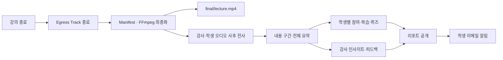

# ZANI 최종 시연 시나리오

> 목표: 로그인부터 실시간 강의, 녹화, 사후 분석과 리포트까지 하나의 제품 흐름으로 검증한다.
>
> 운영 주소: `https://i15a105.p.ssafy.io`

## 1. 시연 핵심 메시지

1. 학생 카메라 영상은 서버로 녹화하지 않고 브라우저 안에서 참여도만 판단한다.
2. 강사는 개인 학생 상태가 아니라 익명 집계와 실시간 코칭 팁을 받는다.
3. 강의가 끝나면 녹화 트랙을 최종 MP4로 병합하고 전사·분석·리포트를 자동 생성한다.

## 2. 사전 준비

### 2.1 계정과 장비

- 강사 Google 계정 1개
- 학생 Google 계정 최소 2개
- 강사용 PC: 카메라·마이크·화면 공유 가능
- 학생용 브라우저 또는 휴대폰 2대
- Chrome 최신 버전 권장
- 발표용 강의 자료 또는 YouTube 탭
- 운영망과 제한망 fallback 시험용 핫스팟

### 2.2 운영 점검

```bash
ssh zani
sudo docker compose ls
sudo docker ps
sudo nginx -t
systemctl is-active nginx
systemctl is-active zani-jenkins-agent
curl -fsS http://127.0.0.1:18080/actuator/health
curl -fsS -o /dev/null -w '%{http_code}\n' http://127.0.0.1:13000/
curl -kfsS -o /dev/null -w '%{http_code}\n' https://i15a105.p.ssafy.io/healthz
```

기대값:

- Compose 4개 running
- 컨테이너 9개 running/healthy
- Nginx와 Jenkins Agent `active`
- Backend `UP`
- Frontend와 `/healthz` `200`

### 2.3 데이터 전략

실시간 흐름은 새 강의로 보여주고, 사후 분석 화면은 두 방식 중 하나를 선택한다.

- 권장: 미리 완료된 시드/검증 세션으로 리포트 화면을 즉시 시연
- 추가 검증: 새 강의를 종료한 뒤 Background pipeline 완료까지 추적

새 강의의 전체 사후 분석은 외부 GMS 처리 시간에 따라 발표 시간 안에 끝나지 않을 수 있다.

## 3. 권장 시간표

| 순서 | 내용 | 시간 |
| --- | --- | --- |
| 1 | 서비스 소개·개인정보 원칙 | 1분 |
| 2 | 로그인·강의 생성 | 2분 |
| 3 | 학생 초대·입장 | 2분 |
| 4 | 카메라·마이크·화면 공유 | 3분 |
| 5 | 채팅·손들기·반응 | 2분 |
| 6 | 집중도·확인 질문·코칭 팁 | 3분 |
| 7 | 강의 종료·녹화 설명 | 2분 |
| 8 | 학생·강사 리포트·클립·퀴즈 | 4분 |
| 9 | 기술 구조·마무리 | 1분 |

## 4. 상세 시나리오

### 4.1 Google 로그인

1. `https://i15a105.p.ssafy.io`에 접속한다.
2. Google 로그인 버튼을 누른다.
3. Google 계정을 선택한다.
4. 로그인 후 홈 또는 내 강의실로 이동하는지 확인한다.

정상 결과:

- Google 400 `invalid_request`가 발생하지 않는다.
- `/api/v1/auth/login/google`이 성공한다.
- 새로고침 후에도 refresh cookie로 로그인 상태가 복구된다.

강조할 점: Frontend와 Backend는 같은 Google Web Client ID를 사용하고 Backend가 ID Token audience를 검증한다.

### 4.2 강의 생성

1. 강사 계정에서 강의 생성 화면으로 이동한다.
2. 강의 제목과 필요한 정보를 입력한다.
3. 강의를 생성한다.
4. 생성된 초대 코드/링크를 복사한다.

정상 결과:

- Backend가 `sessionId`와 invite code를 반환한다.
- 강사가 강의실에 입장할 수 있다.
- LiveKit Room은 별도 수동 API 없이 첫 입장 과정에서 준비된다.

### 4.3 학생 입장

1. 학생 브라우저에서 초대 링크를 연다.
2. Google 로그인 후 prejoin 화면으로 이동한다.
3. 카메라·마이크 권한을 허용한다.
4. 학생 두 명이 같은 강의에 입장한다.

정상 결과:

- 강사와 학생 모두 같은 Room에 연결된다.
- 참가자 identity 충돌이 없다.
- 재접속하면 진행 중 강의로 돌아갈 수 있다.
- 브라우저 DevTools WebSocket에서 `/rtc` signal 연결을 확인할 수 있다.

### 4.4 실시간 미디어

1. 강사·학생 카메라와 마이크를 켠다.
2. 강사가 화면 공유를 시작한다.
3. 가능하면 Chrome 탭 공유로 탭 오디오도 공유한다.
4. 학생 화면에서 강사 화면 공유가 메인, 강사 카메라가 PiP로 보이는지 확인한다.
5. 화면 공유를 종료하고 그리드 레이아웃으로 돌아오는지 확인한다.

정상 결과:

- 직접 미디어 경로가 UDP 8802 또는 TCP 8801로 성립한다.
- 강사만 화면 공유를 시작할 수 있다.
- 동시에 두 명이 화면 공유하지 못한다.
- 화면 공유 시작/종료 시 레이아웃이 깨지지 않는다.

### 4.5 채팅·손들기·반응

1. 학생이 채팅을 보낸다.
2. 다른 참가자가 즉시 수신하는지 확인한다.
3. 학생이 손들기를 누른다.
4. 강사 화면에 손들기 알림이 나타나는지 확인한다.
5. 반응 이모지/아이콘을 보낸다.

정상 결과:

- `/ws`가 `101 Switching Protocols`로 연결된다.
- 조용한 상태로 60초가 지나도 STOMP 연결이 끊기지 않는다.
- 채팅·손들기·반응이 동일 세션 참가자에게만 전달된다.

### 4.6 브라우저 집중도와 확인 질문

1. 학생 카메라를 켠 상태에서 참여도 모델이 로드되는지 확인한다.
2. 학생이 일정 시간 화면 밖을 보는 등 테스트 동작을 수행한다.
3. 학생 화면에 확인 질문이 나타나는지 확인한다.
4. 학생이 응답한다.
5. 강사 화면의 익명 그룹 집계가 갱신되는지 확인한다.

정상 결과:

- 원본 카메라 프레임·landmark는 Backend로 전송되지 않는다.
- Backend에는 10초 판단 결과만 전달된다.
- 강사는 개인 학생의 집중 상태를 볼 수 없다.
- 최소 인원·coverage 조건을 충족하지 못하면 그룹 그래프를 숨긴다.

### 4.7 실시간 코칭 팁

1. 강사가 설명을 계속해 코칭용 오디오가 쌓이게 한다.
2. 익명 집중도 저하가 trigger 조건을 충족하도록 시나리오를 만든다.
3. 강사 화면에 코칭 팁이 표시되는지 확인한다.

정상 결과:

- 강사 오디오 60초 미만이면 trigger와 cooldown을 시작하지 않는다.
- 충분한 오디오지만 전사가 비면 `NO_TRANSCRIPT`로 처리한다.
- 팁은 GMS 실제 호출 결과이며 `GMS_MOCK_ENABLED=false`다.
- 같은 trigger 재시도가 DB FK 오류를 만들지 않는다.

발표 시간상 trigger를 빠르게 반복해야 할 때만 `COACHING_TRIGGER_COOLDOWN=PT1M`을 임시 적용하고, 시연 후 `PT10M`으로 복원한다.

### 4.8 녹화 확인

강의 진행 중 다음 대상이 Track Egress로 저장되는지 설명하거나 운영 로그로 확인한다.

- 강사 화면 공유 영상
- 강사 카메라 영상
- 강사 마이크
- 화면 공유 오디오(브라우저가 발행한 경우)
- 학생별 익명 마이크

학생 카메라는 녹화 대상이 아니다.

운영 확인:

```bash
sudo find /srv/zani/recordings/track-egress -type f | tail
sudo docker logs --since 10m zani-egress
sudo docker logs --since 10m zani-livekit
```

로그를 외부에 공유할 때 API key, token, participant 개인 정보를 제거한다.

### 4.9 강의 종료

1. 강사가 강의 종료를 누른다.
2. 학생이 강의를 전체 종료할 수 없는지 확인한다.
3. 참가자들이 종료 화면으로 이동하는지 확인한다.
4. Egress 종료와 webhook 처리를 확인한다.

정상 결과:

- 중복 종료 요청이 멱등하게 처리된다.
- session이 종료 상태가 된다.
- recordings와 outbox가 완료된다.
- finalization job과 postclass pipeline job이 생성된다.

### 4.10 최종 MP4·사후 파이프라인

자동 처리 순서:



파일 확인:

```bash
sudo find /srv/zani/recordings -type f -path '*/final/lecture.mp4' -printf '%p %s bytes\n' | tail
```

정상 결과:

- 검증된 `.partial`만 atomic rename되어 `lecture.mp4`가 된다.
- 재생 API가 인증과 HTTP Range를 지원한다.
- 실패 시 원본 track을 삭제하지 않는다.
- 재시도 lease가 중복 GMS 호출·중복 병합을 막는다.

### 4.11 학생 리포트

완료된 학생 계정으로 `/my-lectures/{sessionId}/report`를 연다.

확인 항목:

- 10초 원본 판단을 사용한 집중도 흐름
- 강의 내용별 타임라인·요약
- 학생 개인 참여 요약
- 복습 추천 0~5개
- 복습 클립 timestamp 클릭 시 영상 이동
- 4지선다 퀴즈와 해설
- 다른 학생의 개인 데이터가 보이지 않음

### 4.12 강사 리포트

같은 세션의 강사 계정으로 리포트를 연다.

확인 항목:

- 최소 인원 정책이 적용된 그룹 집중도 흐름
- 수업 내용 구간과 전체 요약
- 분야별 평가·인사이트·개선 제안
- 학생 개인 지표·실명이 노출되지 않음
- 강사 클립 timestamp 클릭 시 영상 이동

### 4.13 리포트 챗봇

리포트 챗봇은 현재 `dev`에 포함돼 있다. Backend/Frontend가 기준 커밋으로 배포됐는지 확인한 뒤 수행한다.

1. 리포트 요약 텍스트를 드래그한다.
2. `AI에게 묻기` 버튼으로 질문한다.
3. 답변의 실제 전사 인용을 확인한다.
4. 인용을 눌러 녹화 영상이 해당 시각으로 이동하는지 확인한다.

답변이 실패하면 `GMS_ASSISTANT_TIMEOUT`, `REPORT_ASSISTANT_MAX_COMPLETION_TOKENS`, GMS secret과 Backend 로그를 확인한다.

## 5. 제한망 TURN fallback 시험

1. 정상 네트워크에서 직접 UDP 연결을 먼저 확인한다.
2. 교육장 제한망 또는 직접 미디어 포트가 막힌 환경으로 전환한다.
3. WebRTC internals에서 selected candidate pair를 확인한다.
4. relay candidate와 TURN/TLS 8443 사용 여부를 확인한다.
5. 양방향 카메라·마이크·화면 공유를 최소 2분 유지한다.

TURN 연결만 성립하고 실제 미디어가 흐르지 않는 경우도 있으므로 음성·영상 송수신까지 확인해야 한다.

## 6. 장애 시 대체 시연

| 장애 | 즉시 확인 | 대체 시연 |
| --- | --- | --- |
| Google 로그인 실패 | Client ID, Authorized origin, Frontend 재빌드 | 로그인 완료 계정 세션 사용 |
| WebRTC 연결 실패 | 어댑터 고정 IPv4 해제, 8801/8802, TURN 8443 | 정상 핫스팟과 사전 녹화 사용 |
| `/ws` 실패 | Nginx `/ws`, `101`, timeout 3600s | 실시간 미디어 흐름 우선 시연 |
| GMS 실패 | mock flag, API key, timeout, outbound | 미리 완료된 리포트 사용 |
| Egress 실패 | Redis Media, 디스크, 권한, Egress 로그 | 검증된 최종 MP4 사용 |
| 사후 분석 지연 | `pipeline_jobs` 상태·재시도 | 시드 세션 리포트 사용 |
| 이메일 실패 | SMTP 앱 비밀번호·outbox | 화면에서 리포트 공개 확인 |

## 7. 시연 결과 기록

| 항목 | 결과 | 시각 | 비고 |
| --- | --- | --- | --- |
| Google 로그인 | 미실행 | | |
| 강의 생성·학생 입장 | 미실행 | | |
| 카메라·마이크·화면 공유 | 미실행 | | |
| 채팅·손들기·반응 | 미실행 | | |
| 집중도·확인 질문 | 미실행 | | |
| 실시간 코칭 팁 | 미실행 | | |
| 녹화·강의 종료 | 미실행 | | |
| 최종 MP4 | 미실행 | | |
| 학생·강사 리포트 | 미실행 | | |
| 이메일 | 미실행 | | |
| TURN/TLS fallback | 미실행 | | |
| 리포트 챗봇 | 미실행 | | |
